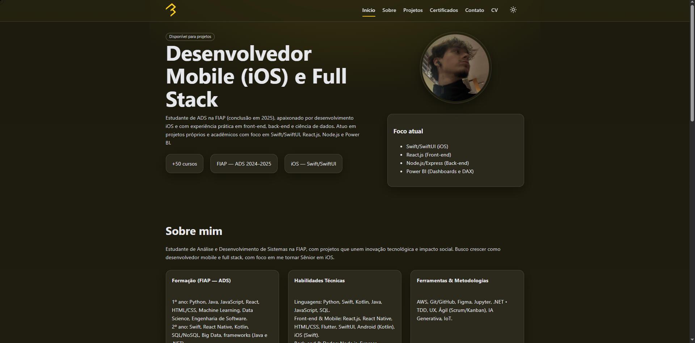
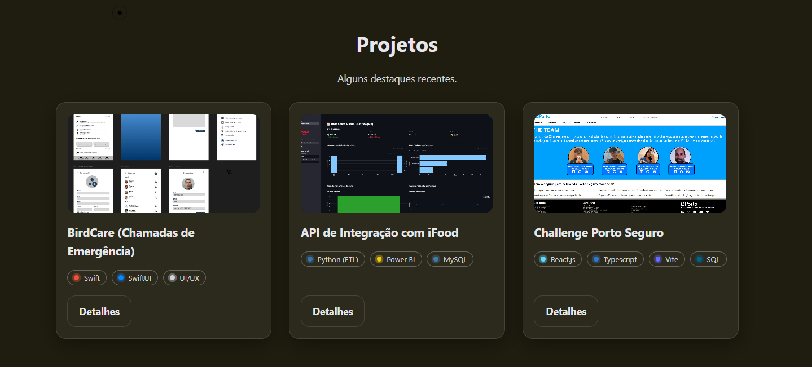
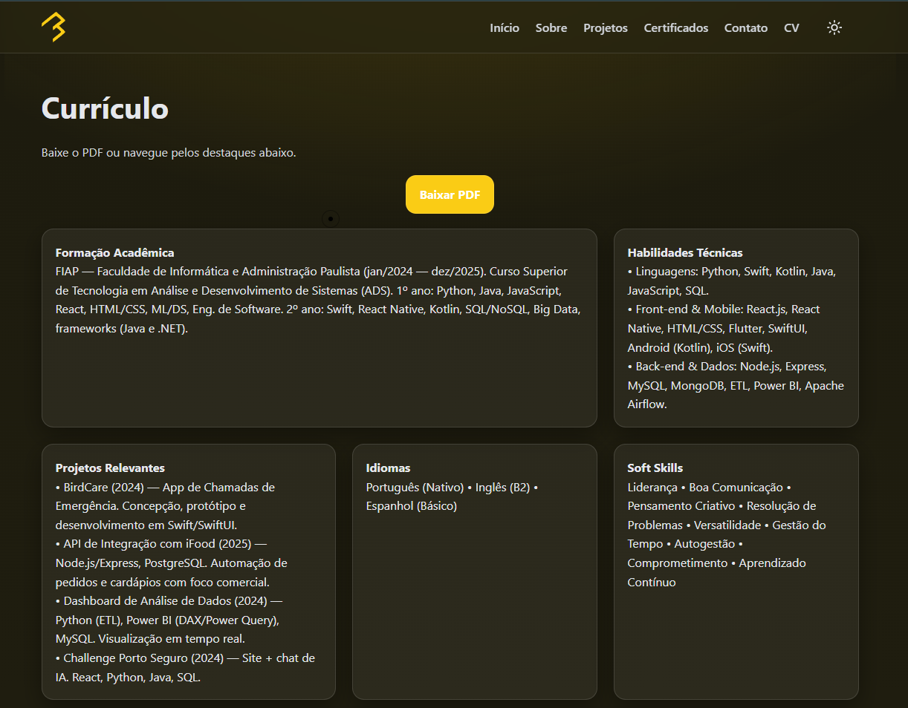

# Portfólio Pessoal — Allan Gabriel Baeza

<div align="center">
  

  <p>
    <a href="#-sobre">Sobre</a> •
    <a href="#-funcionalidades">Funcionalidades</a> •
    <a href="#-estrutura">Estrutura</a> •
    <a href="#-como-rodar">Como rodar</a> •
    <a href="#-pwa">PWA</a> •
    <a href="#-comentarios-no-codigo">Comentários no código</a> •
    <a href="#-contato">Contato</a>
  </p>
</div>

---

## 🔎 Sobre

Site pessoal em HTML, CSS e JavaScript puro, com foco em performance, acessibilidade e experiência em mobile/desktop. É onde concentro meus projetos, currículo, certificados e formas de contato.

### Capturas do site

<p align="center">
  
</p>

<p align="center">
  
  
  
</p>

## ✨ Funcionalidades

- Responsivo: layout fluido do mobile ao desktop.
- Acessível: ARIA no menu, foco visível e skip link.
- Tema claro/escuro com persistência (localStorage).
- Navegação suave, destaque de seção ativa e micro‑interações.
- PWA (service worker cache‑first) para navegação offline básica.
- Contato: formulário com fallback mailto e WhatsApp direto.
- Páginas internas com cabeçalho/rodapé padronizados e currículo com grid otimizado.

## 🧱 Estrutura

```
Portfolio_Merged/Portfolio_Merged
├── index.html               # Home (sobre, projetos, contato)
├── pages/
│   ├── sobre.html           # Sobre (detalhado)
│   ├── projetos.html        # Projetos (destaques)
│   ├── certificados.html    # Certificados (render dinâmico)
│   └── curriculo.html       # Currículo (grid com áreas)
├── scripts/
│   └── app.js               # Navegação, tema, scroll, contato, etc.
├── styles/
│   └── style.css            # Tema, layout e componentes
├── img/                     # Imagens de projetos e avatar
├── assets/                  # Ícones e PDF
├── sw.js                    # Service Worker (cache-first)
└── manifest.webmanifest     # Manifesto PWA
```

## ▶️ Como rodar

Por ser um site estático, sirva a pasta para que o Service Worker funcione (o protocolo `file://` não registra SW).

Opções rápidas:

- VS Code: extensão “Live Server” e abrir `index.html`.
- Node: `npx serve` na raiz `Portfolio_Merged/Portfolio_Merged`.
- Python: `python -m http.server 8080` e abrir `http://localhost:8080`.

Configurar e‑mail do formulário (opcional):

- Em `index.html`, defina no formulário `data-email-to="seu-email@exemplo.com"`.
- Alternativamente, em `scripts/app.js`, configure EmailJS ou GAS (ver abaixo).

## 📱 PWA

- Estratégia: cache‑first para `index.html`, CSS/JS, logo e páginas internas (veja `ASSETS` em `sw.js`).
- Instalação: o navegador pode sugerir “instalar” no desktop/mobile; funciona melhor em HTTPS.
- Offline: páginas e assets listados continuam acessíveis sem rede.

## 🧩 Comentários no código

Adicionados comentários JSDoc nas funções principais para facilitar manutenção:

- `scripts/app.js`
  - Menu mobile: `closeMenu()` e `openMenu()` (sincronia de ARIA e efeitos colaterais).
  - Tema: `syncThemeButtonA11y()` e `toggleTheme()` (persistência e acessibilidade).
  - Contato: `sendEmailJS()`, `sendGAS()`, `getToEmail()`, `sendMailto()`, `isEmailJsReady()`, `isGasReady()` (contratos e comportamento).
- `sw.js`
  - Blocos `install`, `activate` e `fetch` explicados com a estratégia cache‑first e limpeza de versões antigas.

Pontos de extensão úteis:

- Habilitar EmailJS: preencha `EMAILJS_SERVICE_ID`, `EMAILJS_TEMPLATE_ID` e `EMAILJS_PUBLIC_KEY` em `scripts/app.js`.
- Usar GAS: defina `GAS_URL` para receber os dados do formulário.
- Ajustar o currículo: altere as áreas do grid em `#cv-grid` (style.css) para reorganizar os cards.

## 📬 Contato

Allan Gabriel Baeza — allanbamirati@live.com

