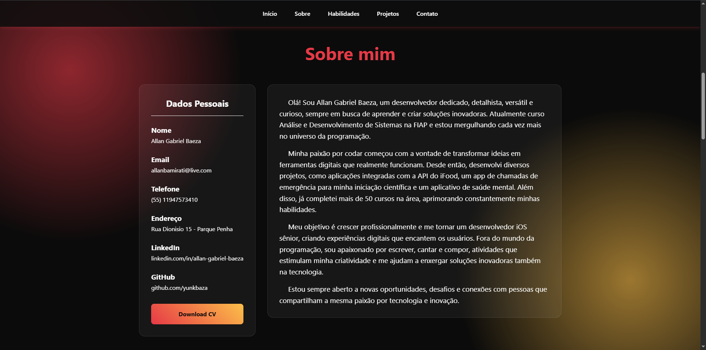

# Portfólio Pessoal | Allan Gabriel Baeza

<p align="center">
  
</p>

<p align="center">
  <strong><a href="https://yunkbaza.github.io/Portfolio/" target="_blank">Ver Demonstração ao Vivo »</a></strong>
</p>

<p align="center">
  <a href="#-sobre-o-projeto">Sobre</a> •
  <a href="#-funcionalidades">Funcionalidades</a> •
  <a href="#-tecnologias">Tecnologias</a> •
  <a href="#-como-executar">Como Executar</a> •
  <a href="#-licença">Licença</a> •
  <a href="#-contato">Contato</a>
</p>

---

## 🚀 Sobre o Projeto

Este é o meu portfólio pessoal, uma landing page desenvolvida para ser o ponto central da minha jornada como desenvolvedor. O objetivo é apresentar minha identidade profissional, centralizar meus projetos mais relevantes e compartilhar um pouco sobre minhas habilidades e paixões.

O design foi pensado para ser moderno e responsivo, utilizando efeitos de *glassmorphism* e animações sutis para criar uma experiência de usuário agradável e dinâmica. A estrutura do código é modular e organizada, refletindo as boas práticas de desenvolvimento que aplico no meu dia a dia.

## ✨ Funcionalidades

* **Design Responsivo:** Totalmente adaptado para uma navegação fluida em desktops, tablets e celulares.
* **Animações de Scroll:** Elementos da página surgem de forma suave conforme o usuário navega.
* **Seções Detalhadas:** Apresentação clara das seções "Sobre mim", "Habilidades", "Projetos" e "Contato".
* **Menu Mobile:** Menu "hamburger" funcional para uma navegação intuitiva em telas menores.
* **Formulário de Contato Profissional:** Integração com **EmailJS** para envio direto de mensagens para minha caixa de entrada.
* **Botão Voltar ao Topo:** Melhora a experiência de navegação em páginas mais longas.

## 💻 Tecnologias

Este projeto foi construído do zero utilizando as seguintes tecnologias:


## 🛠 Como Executar

Se você deseja executar este projeto localmente, siga os passos abaixo:

```bash
# 1. Clone este repositório
git clone [https://github.com/yunkbaza/Portfolio.git](https://github.com/yunkbaza/Portfolio.git)

# 2. Navegue até o diretório do projeto
cd Portfolio

# 3. Abra o arquivo `index.html` no seu navegador
#    (Recomendado usar a extensão "Live Server" do VSCode para melhor experiência)
```

## 📜 Licença

Este projeto está sob a licença MIT. Veja o arquivo [LICENSE](LICENSE) para mais detalhes.

---

## 📫 Contato
**Allan Gabriel Baeza** - allanbamirati@live.com